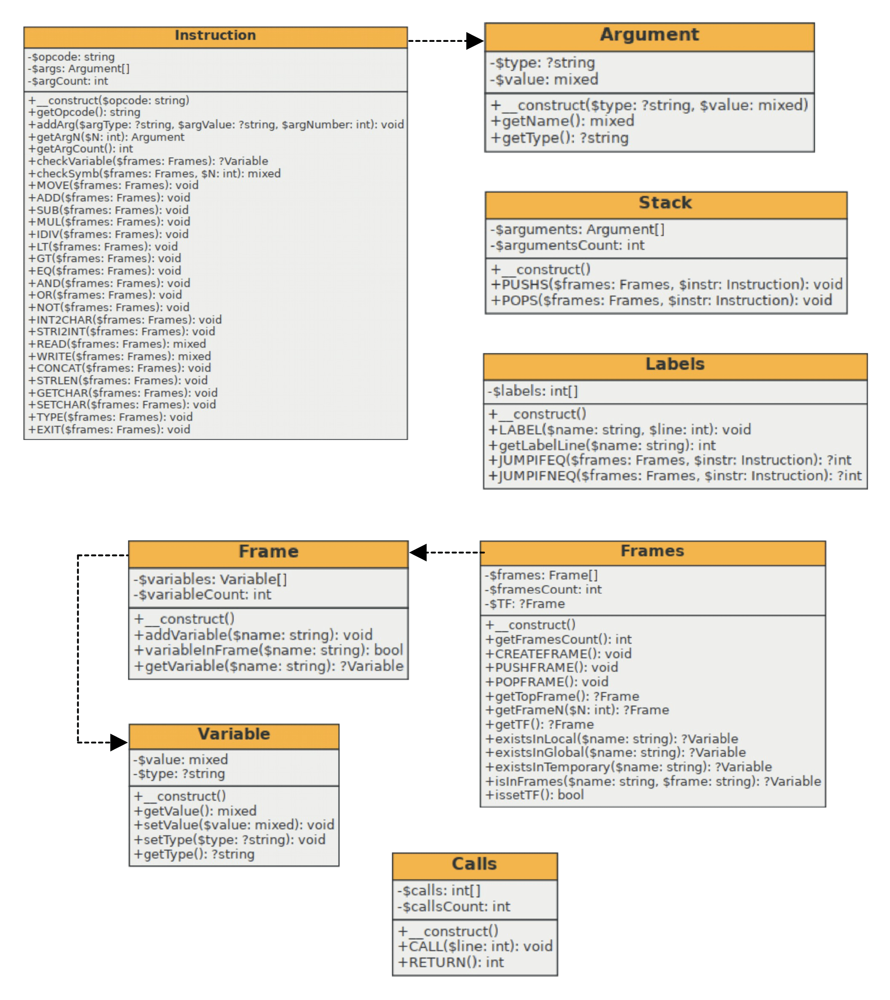

## Implementační dokumentace k 2. úloze do IPP 2023/2024
**Jméno a příjmení:** Kryštof Michálek  
**Login:** xmicha94

## Popis programu
Program, jak již je dáno ze zadání, vezme vstupní xml soubor a text na standartním vstupu.
Jednotlivé instrukce z tohoto xml souboru jsou jedna po jedné čteny a vykonávány.
Program je napsán v jazyce PHP, pro překlad bylo použito PHP8.3.

## Instalace a spuštění
Tento projekt byl vypracován v rámci zadání do předmětu IPP, kde nám byl poskytnut rámec ipp-core s předpřipravenými funkcemi pro načtení a základní ověření vstupního XML souboru.
Spuštění probíhá ze složky ipp-core/ pomocí příkazu:
```
php8.3 interpret.php --source=[vsupní_xml_soubor] --input=[soubor_se_vstupy]
```
Alespoň jeden z těchto argumentů je povinný, druhý lze zapsat ručně do terminálu.
V případě nejasností lze vypsat nápovědu následovně:
```
php8.3 interpret.php --help
```
## Třídy
Jelikož je vhodné, v tomto projektu i povinné, pracovat objektově, vytvořil jsem si několik tříd a metod pro lepší práci s daty.
Všechny mnou vytvořené třídy, u kterých by mohly být nejasnosti, jsou okomentované přímo v kódu.
Zde pouze popíšu, k čemu v mé implementaci jednotlivé třídy slouží.
I přes doporučení v zadání o nepoužívání navrhového vzoru jedináček, jsem ho i přes to, i kvůli svému amatérismu v objektově orientovaném programování, nejednou ve svém projektu využil.

#### Argument
Tato třída slouží k uchování jednotlivých argumentů, které jsou využity třídou Instruction.
Každý argument má své jméno a typ. Jméno je samostatná hodnota kostanty či název proměnné společně s rámcem. Typ je potom datový typ konstanty, nebo var v případě proměnné.

#### Calls
Uchovává kolikrát se použila instrukce CALL v proměnné callsCount a pole calls s řádky, na kterých byly instrukce CALL a na které se vrátit při instrukci RETURN. Jak pole calls tak callsCount jsou datového typu int.
Třída obsahuje funkce CALL a RETURN, jejich funkcionalita je popsána v zadání projektu.

#### Frame
Uchovává pole s proměnnými uloženými v tomto rámci v poli variables, který je typu Variable a počet těchto proměnných, uložených v tomto rámci, v proměnné variableCount, která je typu int.
Obsahuje základní funkce pro práci s promennými v tomto rámci.

#### Frames
Ukládá pole s jednotlivými rámci, počet uložených rámců a zvlášt dočasný rámec.
Jsou zde implementovány instrukce CREATEFRAME, PUSHFRAME a POPFRAME, další funkce pro práci s rámci a pomocná funkce pro hledání proměnné v rámcích.
Například funcke isInFrames, zjistí, zdali proměnná existuje v některém rámci.

#### Instruction
Zde jsou uloženy informace o instrukci(opcode, pole s argumenty této instrukce a počet těchto argumentů).
Zde jsou implementovány instrukce MOVE, ADD, SUB, MUL, IDIV, LT, GT, EQ, AND, OR, NOT, INT2CHAR, STRI2INT, READ, WRITE, CONCAT, STRLEN, GETCHAR, SETCHAR, TYPE a EXIT.
Jejich funkcionalita je opět popsána v zadání.

#### Interpreter
Zde ve zkratce probíhá načtení a iterace přes všechny instrukce, na základě těchto instrukcí se poté volají funkce implementované v jiných třídách.
Nejprve projde přes všechny instrukce a uloží si pozici všech instrukcí LABEL, aby nedošlo k chybě při skocích.
Při druhém průchodu se již provádí všechny ostatní instrukce.

#### Labels
Uchovává v poli řádky, na kterých jsou jednotlivé štítky.
Obsahuje instrukce LABEL, JUMPIFEQ, JUMPIFNEQ.

#### Stack
Uchovává pole s argumenty a jejich počet.
Zde jsou implementovány instrukce PUSHS a POPS.

#### Variable
Zde jsou uloženy jednotlivé proměnné, přesněji jejich hodnota a typ.

## Diagram tříd
Diagram tříd je částečně vygenerován pomocí PHUML, bohužel se mi nepodařilo vygenerovat i spoje, proto jsem je musel dodělat zvlášť a kvůli časové tísni je diagram horší kvality.


## Testování
Ze začátku jsem si testoval některé instrukce sám psaním vlastních primitivních testů a řučním spouštěním a kontrolou.
Poté jsem si ukradl automatizované o něco komplexnější testy, které byly poskytnuté někým na discordovém školním serveru.

## PHPstan
Kontrola programu pomocí PHPstan prošla na level 6 bez errorů.